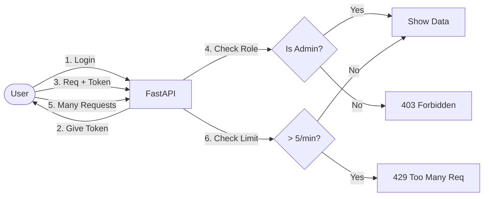

# FastAPI Auth & Rate Limiting Class Guide

**Topic**: Signup/Login, RBAC (Role-Based Access Control), Rate Limiting, and Context7 MCP.

This guide contains the complete code for the session. Follow the steps sequentially to build the project.

## 🏗️ Workflow Diagram



---

## Step 1: Project Setup

Initialize the project and install dependencies using `uv`.

```bash
# 1. Initialize project
uv init

# 2. Add dependencies
uv add fastapi uvicorn[standard] pydantic "passlib[bcrypt]" "bcrypt==4.0.1" python-jose[cryptography] python-multipart slowapi
```

> [!IMPORTANT]
> We explicitly install `"bcrypt==4.0.1"` because newer versions cause compatibility issues with `passlib`.

---

## Step 2: Create Data File

Create an empty file named `users.json` in the root directory. This will act as our local database.

**File:** `users.json`
```json
[]
```

---

## Step 3: Define Models

Create the Pydantic models for Users and Tokens.

**File:** `models.py`
```python
from enum import Enum
from pydantic import BaseModel
from typing import Optional

class UserRole(str, Enum):
    OWNER = "owner"
    ADMIN = "admin"
    USER = "user"

class UserBase(BaseModel):
    username: str
    email: Optional[str] = None
    full_name: Optional[str] = None
    role: UserRole = UserRole.USER

class UserCreate(UserBase):
    password: str

class UserInDB(UserBase):
    hashed_password: str

class Token(BaseModel):
    access_token: str
    token_type: str

class TokenData(BaseModel):
    username: Optional[str] = None
    role: Optional[UserRole] = None
```

**🔍 Code Breakdown:**
*   `class UserRole(str, Enum)`: Defines strict choices for roles (Owner, Admin, User) to prevent invalid values.
*   `class UserBase(BaseModel)`: Shared properties (username, email) that both the API and DB use.
*   `class UserCreate(UserBase)`: Used for Signup. Contains the raw `password` (which we will hash later).
*   `class UserInDB(UserBase)`: Represents the user stored in `users.json`. It has `hashed_password` instead of plain `password`.
*   `class Token(BaseModel)`: The response schema for the Login API (returns a JWT access token).

---

## Step 4: Database Utilities

Create helper functions to read/write to the JSON file.

**File:** `db_utils.py`
```python
import json
from typing import List, Optional
from models import UserInDB

DB_FILE = "users.json"

def get_users() -> List[dict]:
    try:
        with open(DB_FILE, "r") as f:
            return json.load(f)
    except FileNotFoundError:
        return []

def get_user_by_username(username: str) -> Optional[UserInDB]:
    users = get_users()
    for user in users:
        if user["username"] == username:
            return UserInDB(**user)
    return None

def save_user(user: UserInDB):
    users = get_users()
    users.append(user.dict())
    with open(DB_FILE, "w") as f:
        json.dump(users, f, indent=4)
```

**🔍 Code Breakdown:**
*   `get_users()`: Reads the `users.json` file. If the file is missing, it returns an empty list `[]`.
*   `get_user_by_username()`: Loops through the list of users to find one matching the given username. Returns `None` if not found.
*   `save_user()`: Appends a new dictionary to the list and overwrites `users.json` with the updated data.

---

## Step 5: Rate Limiter Configuration

Set up the request limiter.

**File:** `limiter.py`
```python
from slowapi import Limiter
from slowapi.util import get_remote_address

# Initialize the Limiter with the function to get the remote address (IP)
limiter = Limiter(key_func=get_remote_address)
```

**🔍 Code Breakdown:**
*   `Limiter(key_func=get_remote_address)`: Creates the rate limiter. `key_func` tells it *how* to identify users. Here, we identify them by their IP address (`get_remote_address`).

---

## Step 6: Authentication Logic

Implement password hashing and JWT token handling.

**File:** `auth.py`
```python
from datetime import datetime, timedelta
from typing import Optional
from jose import JWTError, jwt
from passlib.context import CryptContext
from fastapi import Depends, HTTPException, status
from fastapi.security import OAuth2PasswordBearer
from models import TokenData, UserRole, UserInDB
from db_utils import get_user_by_username

# Security configurations
SECRET_KEY = "mysecretkey"  # Change this in production!
ALGORITHM = "HS256"
ACCESS_TOKEN_EXPIRE_MINUTES = 30

pwd_context = CryptContext(schemes=["bcrypt"], deprecated="auto")
oauth2_scheme = OAuth2PasswordBearer(tokenUrl="token")

def verify_password(plain_password, hashed_password):
    return pwd_context.verify(plain_password, hashed_password)

def get_password_hash(password):
    return pwd_context.hash(password)

def create_access_token(data: dict, expires_delta: Optional[timedelta] = None):
    to_encode = data.copy()
    if expires_delta:
        expire = datetime.utcnow() + expires_delta
    else:
        expire = datetime.utcnow() + timedelta(minutes=15)
    to_encode.update({"exp": expire})
    encoded_jwt = jwt.encode(to_encode, SECRET_KEY, algorithm=ALGORITHM)
    return encoded_jwt

async def get_current_user(token: str = Depends(oauth2_scheme)):
    credentials_exception = HTTPException(
        status_code=status.HTTP_401_UNAUTHORIZED,
        detail="Could not validate credentials",
        headers={"WWW-Authenticate": "Bearer"},
    )
    try:
        payload = jwt.decode(token, SECRET_KEY, algorithms=[ALGORITHM])
        username: str = payload.get("sub")
        role: str = payload.get("role")
        if username is None:
            raise credentials_exception
        token_data = TokenData(username=username, role=role)
    except JWTError:
        raise credentials_exception
    
    user = get_user_by_username(username=token_data.username)
    if user is None:
        raise credentials_exception
    return user

async def get_current_active_user(current_user: UserInDB = Depends(get_current_user)):
    return current_user

def check_role(required_role: UserRole):
    def role_checker(current_user: UserInDB = Depends(get_current_active_user)):
        if current_user.role != required_role:
            raise HTTPException(
                status_code=status.HTTP_403_FORBIDDEN,
                detail="Operation not permitted"
            )
        return current_user
    return role_checker
```

**🔍 Code Breakdown:**
*   `pwd_context = CryptContext(...)`: Sets up `bcrypt` for secure password hashing.
*   `verify_password(...)`: Checks if a user's plain password matches the hashed one in the DB (returns True/False).
*   `create_access_token(...)`: Generates the JWT. We refer to the user by `sub` (subject) and include their `role`.
*   `get_current_user(...)`: The core dependency. It extracts the Token from the header, decodes it, and retrieves the user from the DB.
*   `check_role(required_role)`: A "factory" function. It returns another function (`role_checker`) that checks if the logged-in user has the specific role required by an endpoint.

---

## Step 7: Main API Application

Connect everything in the main file.

**File:** `main.py`
```python
from datetime import timedelta
from fastapi import FastAPI, Depends, HTTPException, status, Request
from fastapi.security import OAuth2PasswordRequestForm
from slowapi.errors import RateLimitExceeded
from slowapi import _rate_limit_exceeded_handler

from models import UserCreate, UserInDB, Token, UserRole
from db_utils import get_user_by_username, save_user
from auth import (
    create_access_token, 
    get_password_hash, 
    verify_password,
    ACCESS_TOKEN_EXPIRE_MINUTES, 
    get_current_active_user, 
    check_role
)
from limiter import limiter

app = FastAPI()

# Rate Limiter Setup
app.state.limiter = limiter
app.add_exception_handler(RateLimitExceeded, _rate_limit_exceeded_handler)

@app.post("/signup", response_model=Token)
async def signup(user: UserCreate):
    existing_user = get_user_by_username(user.username)
    if existing_user:
        raise HTTPException(
            status_code=status.HTTP_400_BAD_REQUEST,
            detail="Username already registered"
        )
    
    hashed_password = get_password_hash(user.password)
    user_in_db = UserInDB(**user.dict(exclude={"password"}), hashed_password=hashed_password)
    save_user(user_in_db)
    
    access_token_expires = timedelta(minutes=ACCESS_TOKEN_EXPIRE_MINUTES)
    access_token = create_access_token(
        data={"sub": user.username, "role": user.role}, expires_delta=access_token_expires
    )
    return {"access_token": access_token, "token_type": "bearer"}

@app.post("/token", response_model=Token)
async def login_for_access_token(form_data: OAuth2PasswordRequestForm = Depends()):
    user = get_user_by_username(form_data.username)
    if not user or not verify_password(form_data.password, user.hashed_password):
        raise HTTPException(
            status_code=status.HTTP_401_UNAUTHORIZED,
            detail="Incorrect username or password",
            headers={"WWW-Authenticate": "Bearer"},
        )
    
    access_token_expires = timedelta(minutes=ACCESS_TOKEN_EXPIRE_MINUTES)
    access_token = create_access_token(
        data={"sub": user.username, "role": user.role}, expires_delta=access_token_expires
    )
    return {"access_token": access_token, "token_type": "bearer"}

@app.get("/users/me", response_model=UserInDB)
async def read_users_me(current_user: UserInDB = Depends(get_current_active_user)):
    return current_user

@app.get("/admin/dashboard")
async def admin_dashboard(current_user: UserInDB = Depends(check_role(UserRole.ADMIN))):
    return {"message": f"Welcome Admin {current_user.username}!"}

@app.get("/owner/settings")
async def owner_settings(current_user: UserInDB = Depends(check_role(UserRole.OWNER))):
    return {"message": f"Welcome Owner {current_user.username}!"}

@app.get("/limited")
@limiter.limit("5/minute")
async def limited_endpoint(request: Request):
    return {"message": "This endpoint is rate limited to 5 requests per minute."}
```

**🔍 Code Breakdown:**
*   `app.state.limiter = limiter`: Registers our rate limiter with the FastAPI app.
*   `@app.post("/signup")`: Registers a new user. It hashes the password before saving to `users.json`.
*   `@app.post("/token")`: The Login endpoint. It uses `OAuth2PasswordRequestForm` to receive `username` and `password`, validates them, and returns a JWT token.
*   `Depends(get_current_active_user)`: Protects the `/users/me` route. Only valid tokens can access this.
*   `Depends(check_role(UserRole.ADMIN))`: Enforces RBAC. Even if you have a valid token, you must have the `admin` role to access this.
*   `@limiter.limit("5/minute")`: The decorator that strictly limits this specific endpoint to 5 calls per minute per IP address.

---

## Step 8: Run

Start the server using `uv run`.

```bash
uv run uvicorn main:app --reload
```
